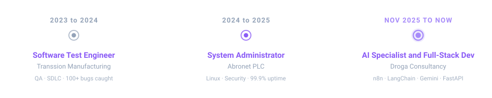
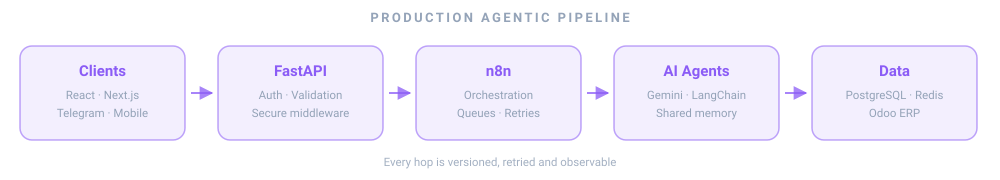

<div align="center">


</div>

<br/>

<div align="center">

[](https://git.io/typing-svg)

</div>

<br/>

<div align="center">

[](https://robel-portfolio-ten.vercel.app/)
&nbsp;
[](https://www.linkedin.com/in/robel-shimeles-154b5a3b8)
&nbsp;
[](mailto:robelshemeles4@gmail.com)

</div>

<div align="center">

</div>

## 💼 Where I've Shipped

<div align="center">



</div>

<br/>

<details>
<summary>&nbsp;<b>🟣 AI Specialist & Full-Stack Developer — Droga Consultancy</b> &nbsp;·&nbsp; <code>Nov 2025 — Present</code></summary>
<br/>

- ▹ **Agentic systems in production:** 26-node pharmacy chatbot (5 Gemini agents with shared memory), Odoo ERP assistant speaking natural language over 8 live SQL tools, Amharic voice registration.
- ▹ **5+ secure FastAPI backends** bridging client frontends to n8n webhook workflows.
- ▹ **SEO + GEO** for drogaconsulting.com — visible in Google *and* AI-powered search.
- ▹ Shipped **DCS Wellness** and **DrogaPulse** SaaS — both live, both in daily use.

`n8n` `LangChain` `FastAPI` `Gemini` `SEO/GEO`

</details>

<details>
<summary>&nbsp;<b>🔵 System Administrator — Abronet PLC</b> &nbsp;·&nbsp; <code>2024 — Dec 2025</code></summary>
<br/>

- ▹ **99.9% uptime** maintained across enterprise platforms.
- ▹ Deployed and secured financial web platforms.
- ▹ Scripted away routine maintenance — less overhead, fewer errors.

`Linux` `Scripting` `Security`

</details>

<details>
<summary>&nbsp;<b>⚪ Software Test Engineer — Transsion Manufacturing</b> &nbsp;·&nbsp; <code>2023 — 2024</code></summary>
<br/>

- ▹ **100+ pre-release bugs** caught across mobile and internal systems.
- ▹ Product quality up **15%** through cross-functional SDLC work.

`QA` `SDLC`

</details>

<div align="center">

</div>

## 🧠 Who Am I?

<table>
<tr>
<td width="55%">

I'm an **AI Specialist & Full-Stack Developer** at **Droga Consultancy** — and I build things that *actually ship*.

My career started in the trenches: **software testing**, **system administration**, and making servers behave. That foundation gave me something most developers lack — a deep instinct for *reliability* at scale.

Today, I architect **agentic AI systems** in production: multi-agent **Gemini** pipelines on **n8n**, natural-language interfaces over live ERP databases, **Amharic voice AI**, and the **FastAPI** middleware that holds it all together.

> *"I don't just write code. I engineer leverage."*

I specialize in building for the **Ethiopian digital market** — high-traffic, low-latency, culturally-aware applications that serve users who deserve world-class software.

</td>
<td width="45%" align="center">

```
┌─────────────────────────────┐
│  💼  Right now              │
│      AI Specialist @        │
│      Droga Consultancy      │
│                             │
│  🤖  Specialty              │
│      Gemini + LangChain     │
│      agents on n8n          │
│                             │
│  🌱  Deep diving into       │
│      LLM fine-tuning        │
│                             │
│  🇪🇹  Based in              │
│      Addis Ababa, Ethiopia  │
│                             │
│  ⚡  Fun fact               │
│      I automate my          │
│      automations            │
└─────────────────────────────┘
```

</td>
</tr>
</table>

<div align="center">

</div>

## 🚀 What I Actually Do

<div align="center">

| 🤖 AI & Agents | 🌐 Full-Stack Dev | ☁️ DevOps & Scale | 🔍 Problem Solving |
|:--------------:|:-----------------:|:-----------------:|:------------------:|
| Multi-agent Gemini pipelines, LangChain tools, Amharic voice AI | End-to-end apps from pixel-perfect UI to rock-solid API | Scalable deploys on Vercel + Render, Dockerized services | Systems thinking for the Ethiopian digital market |
| n8n orchestration · OpenAI & Gemini APIs · Telegram bots | React · Next.js · FastAPI · Flask · Django · Node.js | PostgreSQL · Supabase · Redis · Linux · Git | Agile · Team leadership · Technical communication |

</div>

<div align="center">

</div>

## 🤖 AI & Automation — My Edge

This is what separates me from a typical web developer. I build **systems that think**:

<div align="center">



</div>

<br/>

```python
# What I ship — in production, today 🚀
production = {
    "agentic_ai":     "26-node pharmacy chatbot — 5 Gemini agents with shared memory",
    "erp_copilots":   "Odoo assistant answering natural language via 8 live SQL tools",
    "voice_ai":       "Spoken Amharic in → structured records out",
    "middleware":     "5+ secure FastAPI backends bridging frontends to n8n workflows",
    "saas":           "DCS Wellness + DrogaPulse — live, in daily use, 4 languages",
}

reach  = "20K+ monthly users served by automated content pipelines"
result = "Applications that scale, learn, and adapt — not just run."
```

<div align="center">

</div>

## 🏗 Featured Builds

<div align="center">

| Project | What it is | Stack | Links |
|:--------|:-----------|:------|:-----:|
| **DCS Wellness** ⭐ | AI health platform — streaming diagnostics, Ethiopian food image recognition, 4 languages | `FastAPI` `React` `RN Expo` `Gemini` `Docker` | [Live ↗](https://drogapharma.rw) |
| **DrogaPulse** ⭐ | Social-media SaaS — OAuth2 across 5 platforms, Gemini AI studio, Android via Capacitor | `FastAPI` `React` `Celery` `Redis` `Capacitor` | [Live ↗](https://drogapulse.mafilink.com) |
| **AI Pharmacy Assistant** | 26 nodes, 5 specialist Gemini agents — guides patients, flags stock-outs | `n8n` `Gemini` `AI Agents` | 🟢 In production |
| **Odoo ERP AI Assistant** | Ask the ERP anything — NL over 8 live PostgreSQL tools | `n8n` `LangChain` `PostgreSQL` | 🟢 In production |
| **Amharic Voice Registration** | Voice AI for a language most models overlook | `Gemini 2.5 Flash` `n8n` `Multimodal` | 🟢 In production |
| **Betting Tip by Robel** | 20K+ monthly visitors on automated n8n content pipelines | `Next.js` `n8n` `Vercel` | [Live ↗](https://betting-tip-by-robel.vercel.app/) |
| **AI Cover Letter Generator** | Tailored cover letters for Ethiopian job seekers | `React` `FastAPI` `OpenAI` `Supabase` | [Live ↗](https://ai-cover-letter-ethiopia.vercel.app/) · [Code](https://github.com/Robel231/ai-cover-letter-ethiopia) |
| **SEO + GEO** | drogaconsulting.com ranking in Google *and* AI answers | `Technical SEO` `Schema.org` `GEO` | [Live ↗](https://drogaconsulting.com) |

</div>

<div align="center">

</div>

## 🛠 Tech Arsenal

<div align="center">


</div>

<br/>

**Languages**


**🤖 AI & Automation** ← *This is where it gets interesting*


**Frontend**


**Backend**


**Databases & Cache**


**DevOps & Tools**


<div align="center">

</div>

## 📊 GitHub at a Glance

<br/>

<div align="center">


&nbsp;&nbsp;


</div>

<br/>

<div align="center">


</div>

<br/>

<div align="center">


</div>

<div align="center">

</div>

## 🏆 GitHub Trophies

<div align="center">


</div>

<div align="center">

</div>

## 🌍 Building for Ethiopia & Beyond

I'm not just a developer — I understand the **Ethiopian market** deeply:

- 🗣️ **Amharic-first AI** — voice and language systems for a language most models overlook
- 📱 **Mobile-first architectures** for high-traffic, bandwidth-aware environments
- 🚀 **Performance optimization** for users across Addis Ababa and every region
- 🤝 **Local context** — building solutions that resonate culturally and functionally
- 🌐 **Global standards** — every project meets international engineering quality bars

<div align="center">

</div>

## 📈 Contribution Snake

<div align="center">

<picture>
  <source media="(prefers-color-scheme: dark)" srcset="https://raw.githubusercontent.com/Robel231/Robel231/output/github-contribution-grid-snake-dark.svg">
  <source media="(prefers-color-scheme: light)" srcset="https://raw.githubusercontent.com/Robel231/Robel231/output/github-contribution-grid-snake.svg">
  
</picture>

</div>

> 🐍 The snake workflow ships with this repo (`.github/workflows/snake.yml`) — it runs on every push and daily at midnight. The animation appears right after the first run.

<div align="center">

</div>

## 💬 Let's Build Something

I'm open to:

- 🤝 **Freelance projects** — AI agents, automation, and full-stack builds
- 🌱 **Open-source collaboration** — tools that benefit the Ethiopian developer community
- 💡 **Consulting** — n8n workflows, FastAPI architecture, Gemini & OpenAI integration
- 🚀 **Full-time opportunities** — remote-friendly, ambitious product teams

<br/>

<div align="center">

[](https://robel-portfolio-ten.vercel.app/)
&nbsp;
[](https://www.linkedin.com/in/robel-shimeles-154b5a3b8)
&nbsp;
[](mailto:robelshemeles4@gmail.com)

</div>

<br/>

<div align="center">


<br/>


&nbsp;


<br/>

*⚡ Engineered in Addis Ababa · Deployed to the world 🌍*

</div>
